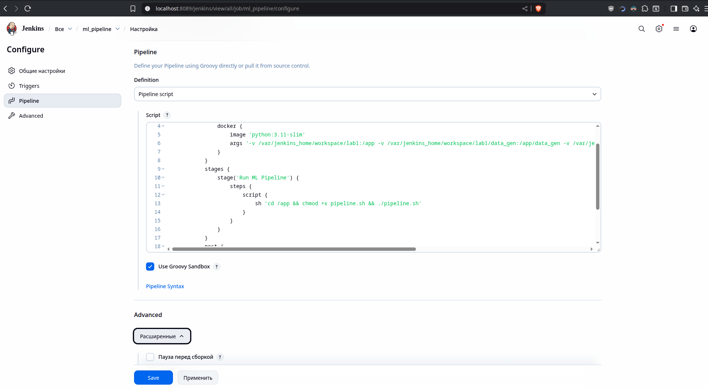
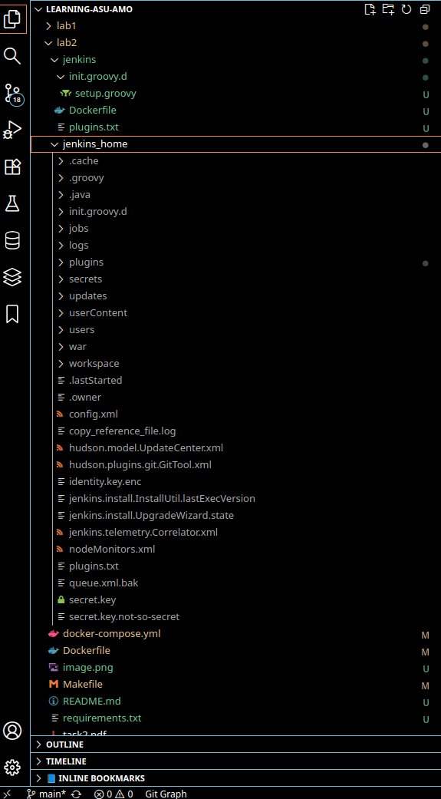

## Знакомство с Jenkins и использование Jenkins

все действия происходят через [Makefile](./Makefile) и [docker-compose.yml](docker-compose.yml):
- `make` запускает первую команду из Makefile ->  
  - сборку сервисов jenkins и ml-pipeline
  - запуск jenkins
  - готовность jenkins через curl
  - запуск в jenkins ml-pipeline
  - jenkins доступен под `admin/admin` на http://localhost:8089

    
<b>Вывод `make`</b>

t4nner@w: lab2 make
Директории созданы
requirements.txt скопирован
[+] Building 61.9s (11/11) FINISHED                                                                                                                               
 => [internal] load local bake definitions                                                                                                                   0.0s
 => => reading from stdin 555B                                                                                                                               0.0s
 => [internal] load build definition from Dockerfile                                                                                                         0.0s
 => => transferring dockerfile: 719B                                                                                                                         0.0s
 => [internal] load metadata for docker.io/jenkins/jenkins:lts-jdk21                                                                                         1.1s
 => [internal] load .dockerignore                                                                                                                            0.0s
 => => transferring context: 2B                                                                                                                              0.0s
 => [1/4] FROM docker.io/jenkins/jenkins:lts-jdk21@sha256:f2519b99350faeaaeef30e3b8695cd6261a5d571c859ec37c7ce47e5a241458d                                   0.0s
 => [internal] load build context                                                                                                                            0.0s
 => => transferring context: 288B                                                                                                                            0.0s
 => CACHED [2/4] COPY --chown=jenkins:jenkins plugins.txt /usr/share/jenkins/ref/plugins.txt                                                                 0.0s
 => [3/4] RUN jenkins-plugin-cli -f /usr/share/jenkins/ref/plugins.txt                                                                                      59.7s
 => [4/4] COPY --chown=jenkins:jenkins init.groovy.d/ /usr/share/jenkins/ref/init.groovy.d/                                                                  0.2s 
 => exporting to image                                                                                                                                       0.5s
 => => exporting layers                                                                                                                                      0.5s
 => => writing image sha256:8a904ff2ad531f699de33741f8c7a23ee823e34299660c8b9276126a95e3cd67                                                                 0.0s
 => => naming to docker.io/library/lab2-jenkins                                                                                                              0.0s
 => resolving provenance for metadata file                                                                                                                   0.0s
[+] Building 1/1
 ✔ lab2-jenkins  Built                                                                                                                                       0.0s 
Jenkins образ успешно собран
[+] Building 1.7s (12/12) FINISHED                                                                                                                                
 => [internal] load local bake definitions                                                                                                                   0.0s
 => => reading from stdin 1.00kB                                                                                                                             0.0s
 => [internal] load build definition from Dockerfile                                                                                                         0.0s
 => => transferring dockerfile: 445B                                                                                                                         0.0s
 => [internal] load metadata for docker.io/library/python:3.11-slim                                                                                          1.3s
 => [internal] load .dockerignore                                                                                                                            0.0s
 => => transferring context: 2B                                                                                                                              0.0s
 => [1/5] FROM docker.io/library/python:3.11-slim@sha256:fa9b525a0be0c5ae5e6f2209f4be6fdc5a15a36fed0222144d98ac0d08f876d4                                    0.0s
 => [internal] load build context                                                                                                                            0.0s
 => => transferring context: 138B                                                                                                                            0.0s
 => CACHED [2/5] WORKDIR /app                                                                                                                                0.0s
 => CACHED [3/5] COPY requirements.txt .                                                                                                                     0.0s
 => CACHED [4/5] RUN pip install --no-cache-dir -r requirements.txt                                                                                          0.0s
 => CACHED [5/5] RUN mkdir -p /app/data_gen /app/data /app/models                                                                                            0.0s
 => exporting to image                                                                                                                                       0.0s
 => => exporting layers                                                                                                                                      0.0s
 => => writing image sha256:6d359049ffb21c8a7fa9093ac8c50b7d4d736345ba73d77d1b2d2514e9ce5f75                                                                 0.0s
 => => naming to docker.io/library/lab2-ml-pipeline                                                                                                          0.0s
 => resolving provenance for metadata file                                                                                                                   0.0s
[+] Building 1/1
 ✔ lab2-ml-pipeline  Built                                                                                                                                   0.0s 
ML pipeline образ успешно собран
[+] Running 1/1
 ✔ Container jenkins_lab2  Started                                                                                                                           0.3s 
Jenkins запускается в фоновом режиме...
Ожидание полной инициализации Jenkins (120 секунд)...
Ожидание... 10 секунд из 120
Jenkins готов к работе
Jenkins доступен по адресу: http://localhost:8089/jenkins
Логин: admin, Пароль: admin
[+] Running 1/1
 ✔ Container ml_pipeline_lab2  Created                                                                                                                       0.1s 
Attaching to ml_pipeline_lab2
ml_pipeline_lab2  | Данные успешно сохранены:
ml_pipeline_lab2  |   train/data.csv: 6132 записей
ml_pipeline_lab2  |   test/data.csv:  2628 записей
ml_pipeline_lab2  |   Всего: 8760 записей (по ~90 дней × 24 часа × 4 сезона)
ml_pipeline_lab2  | Найдено тренировочных файлов: 1
ml_pipeline_lab2  | Найдено тестовых файлов: 1
ml_pipeline_lab2  | Объединено записей в train: 6132
ml_pipeline_lab2  | Объединено записей в test:  2628
ml_pipeline_lab2  | Сохранено:
ml_pipeline_lab2  |   - Тренировочные данные: data/preprocessed_data_train.csv (6132 записей)
ml_pipeline_lab2  |   - Тестовые данные:      data/preprocessed_data_test.csv (2628 записей)
ml_pipeline_lab2  |   - Параметры скалера:    data/scaler_*.npy
ml_pipeline_lab2  | 
ml_pipeline_lab2  | Столбцы в данных: ['day_of_month', 'month', 'hour', 'temperature', 'season', 'source']
ml_pipeline_lab2  | Масштабированные признаки: ['day_of_month', 'month', 'hour', 'season']
ml_pipeline_lab2  | Целевая переменная: temperature
ml_pipeline_lab2  | [Parallel(n_jobs=1)]: Done  49 tasks      | elapsed:    0.1s
ml_pipeline_lab2  | [Parallel(n_jobs=1)]: Done 100 out of 100 | elapsed:    0.3s finished
ml_pipeline_lab2  | Загрузка тренировочных данных из: data/preprocessed_data_train.csv
ml_pipeline_lab2  | Загрузка тестовых данных из: data/preprocessed_data_test.csv
ml_pipeline_lab2  | 
ml_pipeline_lab2  | Размер данных:
ml_pipeline_lab2  |    Тренировочные: 6132 записей
ml_pipeline_lab2  |    Тестовые:      2628 записей
ml_pipeline_lab2  |    Признаки: ['day_of_month', 'month', 'hour', 'season']
ml_pipeline_lab2  |    Целевая переменная: temperature
ml_pipeline_lab2  | Обучение завершено за 0:00:00.284986
ml_pipeline_lab2  | 
ml_pipeline_lab2  | Модель сохранена: models/RandomForestRegressor_20251106_034354.joblib
ml_pipeline_lab2  | \Метаданные сохранены: models/metadata_20251106_034354.json
ml_pipeline_lab2  | [Parallel(n_jobs=1)]: Done  49 tasks      | elapsed:    0.0s
ml_pipeline_lab2  | [Parallel(n_jobs=1)]: Done 100 out of 100 | elapsed:    0.0s finished
ml_pipeline_lab2  | [Parallel(n_jobs=1)]: Done  49 tasks      | elapsed:    0.0s
ml_pipeline_lab2  | [Parallel(n_jobs=1)]: Done 100 out of 100 | elapsed:    0.0s finished
ml_pipeline_lab2  | Автоматически выбран последний файл метаданных: models/metadata_20251106_034354.json
ml_pipeline_lab2  | 
ml_pipeline_lab2  | Загружаем модель из models/RandomForestRegressor_20251106_034354.joblib
ml_pipeline_lab2  | Тренировочные данные из data/preprocessed_data_train.csv
ml_pipeline_lab2  | Тестовые данные из data/preprocessed_data_test.csv
ml_pipeline_lab2  | 
ml_pipeline_lab2  | ==================================================
ml_pipeline_lab2  | РЕЗУЛЬТАТЫ ТЕСТИРОВАНИЯ МОДЕЛИ
ml_pipeline_lab2  | ==================================================
ml_pipeline_lab2  | 
ml_pipeline_lab2  | Метрики качества:
ml_pipeline_lab2  | Набор        | MSE        | MAE        | R2        
ml_pipeline_lab2  | ---------------------------------------------
ml_pipeline_lab2  | Тренировочный | 4.3298 | 1.4851 | 0.9606
ml_pipeline_lab2  | Тестовый       | 4.9336 | 1.5563 | 0.9557
ml_pipeline_lab2  | 
ml_pipeline_lab2  | Анализ переобучения:
ml_pipeline_lab2  |    Отношение MSE (тест/трен): 1.14
ml_pipeline_lab2  | Переобучение минимально.
ml_pipeline_lab2  | 
ml_pipeline_lab2  | Важность признаков:
ml_pipeline_lab2  |    season      : 0.4633
ml_pipeline_lab2  |    month       : 0.4547
ml_pipeline_lab2  |    day_of_month: 0.0810
ml_pipeline_lab2  |    hour        : 0.0010
ml_pipeline_lab2  | 
ml_pipeline_lab2  | Обновлённые метаданные с результатами сохранены: models/metadata_20251106_034354.json
ml_pipeline_lab2  | готово
ml_pipeline_lab2 exited with code 0
ML Pipeline успешно выполнен

#### pipeline запущен, jenkins готов к дальнейшей работе:

