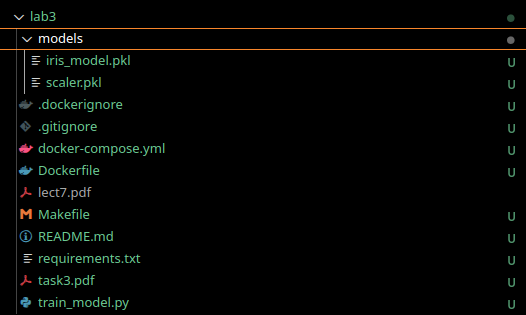
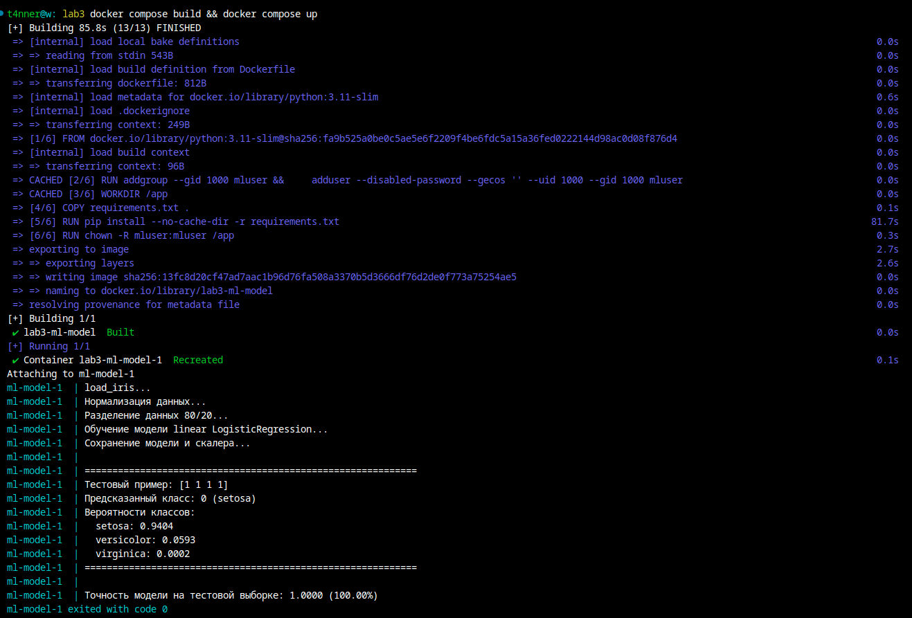

## Отчет по заданию 3 

### Курс "Автоматизация машинного обучения"

<p style="text-align: end;">Выполнил: Артём Кожевников</p>

Репозиторий расположен по адресу https://github.com/4t4nner/learning-asu-amo . Этот отчет [доступен по ссылке](https://github.com/4t4nner/learning-asu-amo/lab3) 



Описание файлов
- [Dockerfile](Dockerfile) - базовый образ Python для задач машинного обучения. Можно применять отдельно по имени образа `base-ml`. Если нужны другие библиотеки - написать их в [requirements.txt](requirements.txt)
- [docker-compose.yml](docker-compose.yml) : Собирает Dockerfile и сопоставляет текущую директорию рабочей директории контейнера
- [Makefile](Makefile) - по команде `make` собирает образ и контейнер, запускает `train_model.py` внутри контейнра
- `models/*.pkl` - результат работы `train_model.py`
- [train_model.py](train_model.py) - запускается в контейнере. Загружает датасет iris, нормализует, обучает линейный регрессор (80/20), оценивает `[1,1,1,1]` и всю тестовую выборку.

#### [train_model.py](train_model.py):
```
import numpy as np
from sklearn.datasets import load_iris
from sklearn.linear_model import LogisticRegression
from sklearn.model_selection import train_test_split
from sklearn.preprocessing import StandardScaler
import joblib
import os

# Создаем директорию для сохранения модели
os.makedirs('models', exist_ok=True)

print("load_iris...")
iris = load_iris()
X = iris.data
y = iris.target

# Нормализация данных (улучшает сходимость и стабильность модели)
print("Нормализация данных...")
scaler = StandardScaler()
X_scaled = scaler.fit_transform(X)

print("Разделение данных 80/20...")
X_train, X_test, y_train, y_test = train_test_split(
    X_scaled, y, test_size=0.2, random_state=42
)

# Обучение модели
print("Обучение модели linear LogisticRegression...")
model = LogisticRegression(max_iter=200, random_state=42)
model.fit(X_train, y_train)

# Сохранение модели и скалера
print("Сохранение модели и скалера...")
joblib.dump(model, 'models/iris_model.pkl')
joblib.dump(scaler, 'models/scaler.pkl')

# Предсказание для тестового примера
test_sample = np.array([[1, 1, 1, 1]])
test_sample_scaled = scaler.transform(test_sample)
prediction = model.predict(test_sample_scaled)
prediction_proba = model.predict_proba(test_sample_scaled)

print("\n" + "="*60)
print(f"Тестовый пример: {test_sample[0]}")
print(f"Предсказанный класс: {prediction[0]} ({iris.target_names[prediction[0]]})")
print(f"Вероятности классов:")
for i, prob in enumerate(prediction_proba[0]):
    print(f"  {iris.target_names[i]}: {prob:.4f}")
print("="*60 + "\n")

# Оценка точности
accuracy = model.score(X_test, y_test)
print(f"Точность модели на тестовой выборке: {accuracy:.4f} ({accuracy*100:.2f}%)")
```

#### Скриншоты
