## Отчет по заданию 4

### Курс "Автоматизация машинного обучения"

<p style="text-align: end;">Выполнил: Артём Кожевников</p>
<p style="text-align: end;">4-406м3</p>

Репозиторий [доступен по ссылке](https://github.com/4t4nner/learning-asu-amo) . Этот отчет [доступен по ссылке](https://github.com/4t4nner/learning-asu-amo/tree/main/lab4) 


### 2. Установите git и dvc
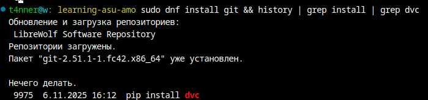

### 3-5. Создайте папку проекта.
```bash
git clone https://github.com/4t4nner/learning-asu-amo
cd learning-asu-amo
mkcd lab4
```
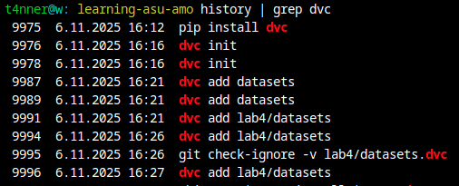

### 6. Настройте удаленное хранилище файлов, например на Google Disk.
- сделал редактируемую всеми папку на гуглдиске (будет удалена после публикации)

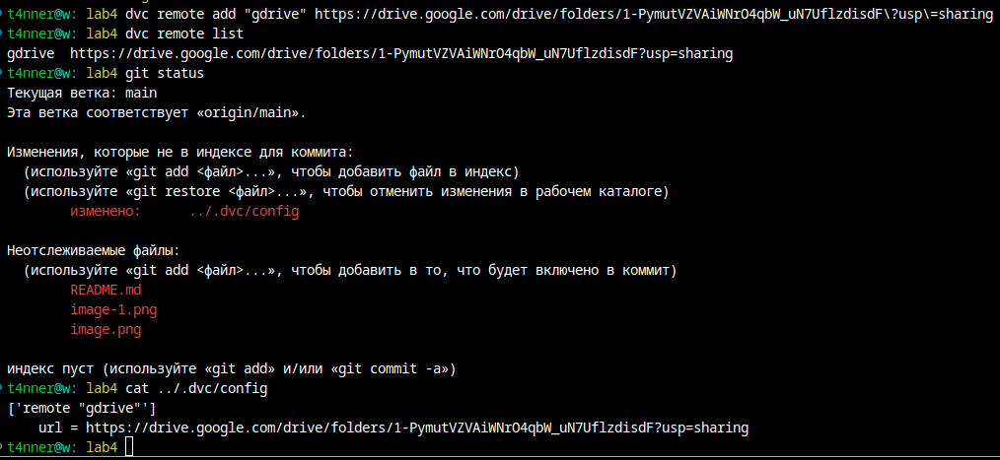

### 7. Создайте датасет о пассажирах “Титаника”, например, catboost.titanic().
- [lab4.py](lab4.py)
```bash
t4nner@w: lab4 code lab4.py
t4nner@w: lab4 source /home/t4nner/.venv         
t4nner@w: lab4 pip install -r requirements.txt 
```
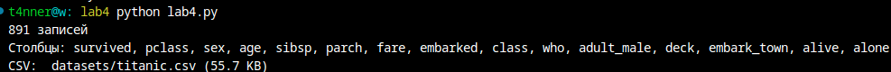


### 
Я так и не смог настроить доступ к gdrive.
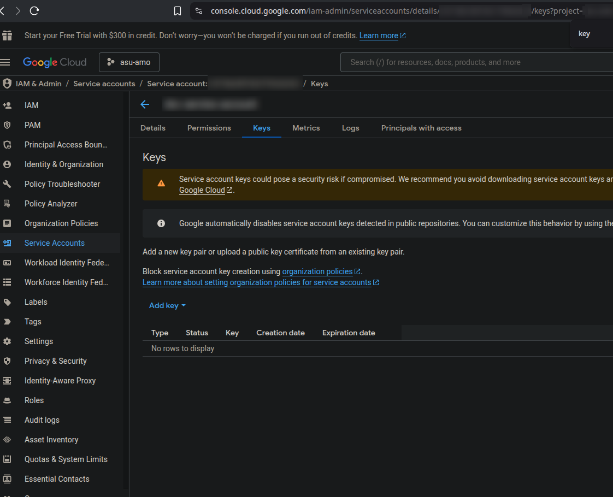
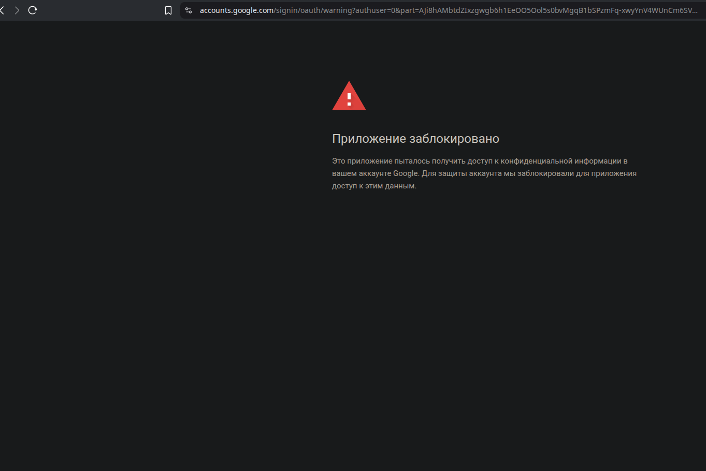
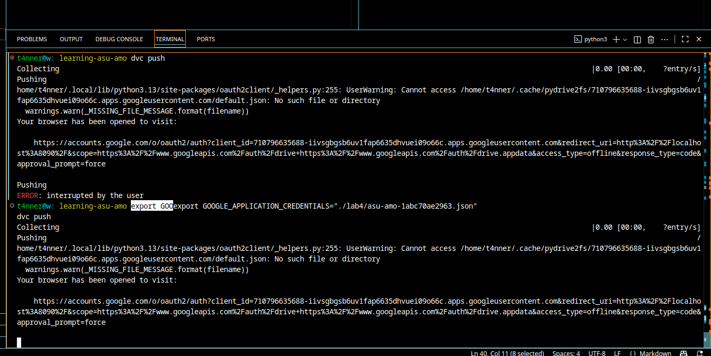
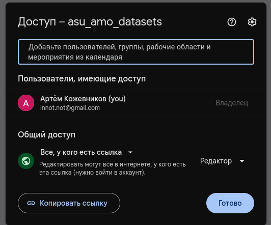
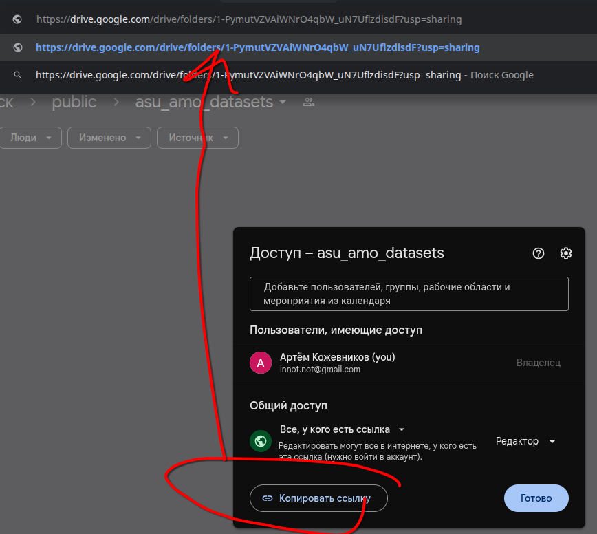

С указанием аккаунта консоли в доступе к папке - всё равно не работает.
```bash
GDRIVE_CREDENTIALS_DATA=/mnt/DATA/projects/asu/learning-asu-amo/lab4/asu-amo-***.json dvc push --remote  gdrive
```


**Буду использовать удалённое ssh хранилище**, доступное по ssh ключу:
```bash
dvc remote add -d <branch_name> ssh://user@host<:optional_port>/path
```
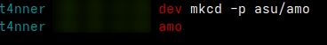
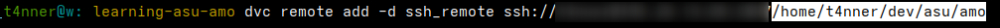
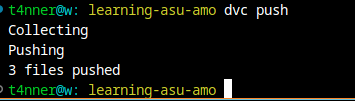

