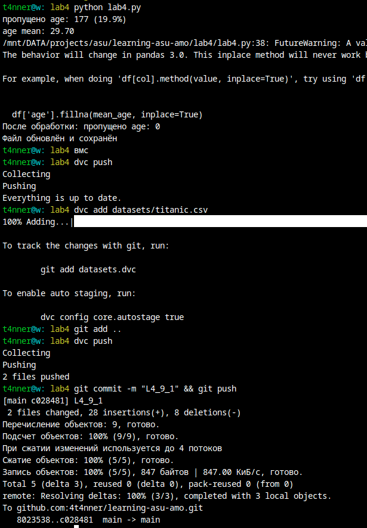
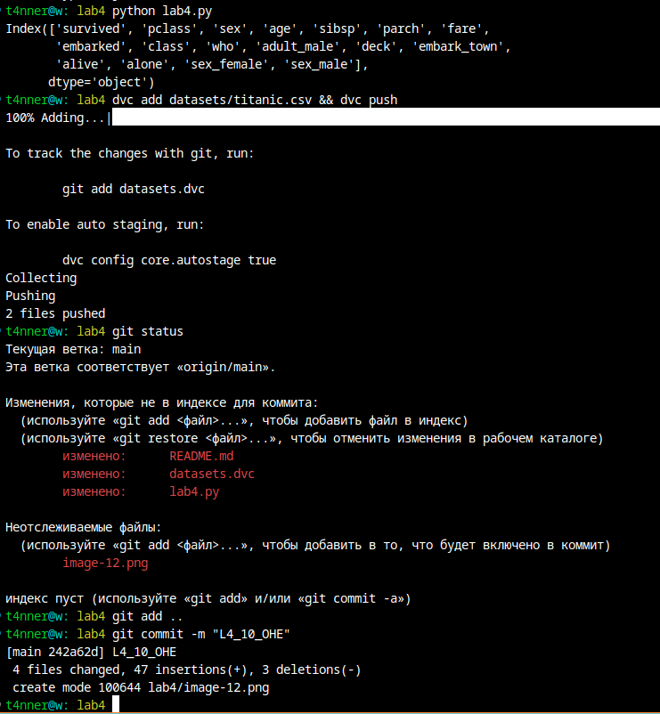

## Отчет по заданию 4

### Курс "Автоматизация машинного обучения"

<p style="text-align: end;">Выполнил: Артём Кожевников</p>
<p style="text-align: end;">4-406м3</p>

Репозиторий [доступен по ссылке](https://github.com/4t4nner/learning-asu-amo) . Этот отчет [доступен по ссылке](https://github.com/4t4nner/learning-asu-amo/tree/main/lab4) 


### 2. Установите git и dvc


### 3-5. Создайте папку проекта.
```bash
git clone https://github.com/4t4nner/learning-asu-amo
cd learning-asu-amo
mkcd lab4
```


### 6. Настройте удаленное хранилище файлов, например на Google Disk.
- сделал редактируемую всеми папку на гуглдиске (будет удалена после публикации)


### 7. Создайте датасет о пассажирах “Титаника”, например, catboost.titanic().
- [lab4.py](lab4.py)
```bash
t4nner@w: lab4 code lab4.py
t4nner@w: lab4 source /home/t4nner/.venv         
t4nner@w: lab4 pip install -r requirements.txt 
```


### 8. Создайте датасет, в котором содержится информация о классе (“Pclass”), поле (“Sex”) и возрасте (“Age”) пассажира. Сделайте коммит в git и push в dvc.
Я так и не смог настроить доступ к gdrive.


С указанием аккаунта консоли в доступе к папке - всё равно не работает.
```bash
GDRIVE_CREDENTIALS_DATA=/mnt/DATA/projects/asu/learning-asu-amo/lab4/asu-amo-***.json dvc push --remote  gdrive
```


**Буду использовать удалённое ssh хранилище**, доступное по ssh ключу:
```bash
dvc remote add -d <branch_name> ssh://user@host<:optional_port>/path
```


### 9. Создайте новую версию датасета, в котором пропущенные (nan) значения в поле “Age” будут заполнены средним значением. Сделайте коммит в git и push в dvc.


<details>
    <summary><b>fill_missing_age_with_mean: </b></summary>

    def fill_missing_age_with_mean():
    df = pd.read_csv(csv_path)
    
    missing_before = df['age'].isna().sum()
    total_rows = len(df)
    print(f"пропущено age: {missing_before} ({missing_before/total_rows*100:.1f}%)")
    
    mean_age = df['age'].mean()
    print(f"age mean: {mean_age:.2f}")
    
    df['age'].fillna(mean_age, inplace=True)
    
    print(f"После обработки: пропущено age: {df['age'].isna().sum()}")
    
    df.to_csv(csv_path, index=False)
    print(f"Файл обновлён и сохранён")
    
    return df
</details>



### 10. Создайте новый признак с использованием one-hot-encoding для строкового признака “Пол” (“Sex”). Сделайте коммит в git и push в dvc.

